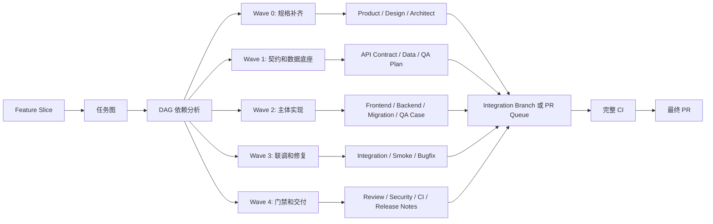
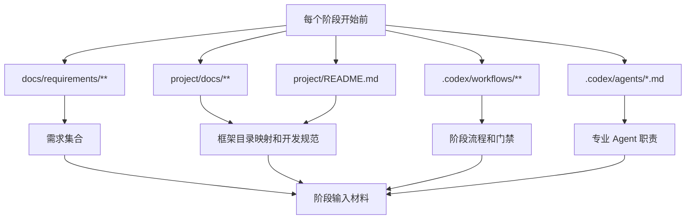

# 项目工作流程图

本流程图描述本仓库基于 `project/` 现有 Snowy 框架进行增量开发的标准协作流程。业务需求来自 `docs/requirements/**`，框架结构和开发规范来自 `project/docs/**`。

## 主流程

```mermaid
flowchart TD
    A([需求或开发请求]) --> B["Orchestrator 进入项目工作流"]
    B --> C["读取 AGENTS.md、workflow、skill"]
    C --> D["阶段 0: 开发环境检测"]
    D --> D1["只读自检: Git、Node、npm、依赖、JDK17、Maven、IDEA、MySQL CLI、MySQL、Redis"]
    D1 --> D2["输出检测清单: ✅ / ⚠️ / ❌"]
    D2 --> D3["写入本机状态: docs/workflow/local-environment-status.md<br/>该文件被 .gitignore 忽略"]
    D3 --> E{"环境选择"}
    E -- "1 环境通过，进入分支确认" --> E1["阶段 0.1: 分支确认<br/>输出当前 Git 分支和工作区状态"]
    E -- "2 环境有警告但继续" --> E1
    E -- "3 环境阻塞先处理" --> D4["处理环境问题后重新自检"]
    E -- "4 暂停" --> END0([暂停])
    D4 --> D
    E1 --> E2{"分支选择"}
    E2 -- "1 以当前分支作为开发分支并继续" --> F["阶段 0.2: 创建需求集成分支"]
    E2 -- "2 切换到其他分支" --> E1
    E2 -- "3 暂停" --> END0

    F --> G["读取 docs/requirements/**"]
    G --> H["读取 project/docs/**、project/docs/patterns/**、project/README.md"]
    H --> I{"需求、框架和环境信息是否充分"}
    I -- 否 --> I1["补充或澄清需求 / 框架文档"]
    I1 --> G

    I -- 是 --> J{"选择开发模式"}
    J -- "简单 CRUD 快速模式" --> J1["优先使用模式缓存<br/>可跳过 PRD/UI<br/>保留最小需求、字段、接口、表结构、验收和风险"]
    J -- "标准 SDLC 模式" --> K{"是否需要 PRD / 低保真原型"}
    J -- "高风险严格模式" --> J2["加强技术、数据、安全、QA、Review 门禁"]
    J -- "自定义" --> J3["记录自定义流程和不可跳过风险"]
    J1 --> N
    J2 --> K
    J3 --> K

    K -- "生成" --> L["Product Agent: PRD、验收标准、HTML PRD、低保真 HTML 原型"]
    K -- "跳过 PRD" --> K1["记录跳过原因和最小需求说明"]
    L --> L1{"PRD / 原型确认"}
    L1 -- 否 --> L
    L1 -- 是 --> M{"是否需要 UI / Figma"}
    K1 --> M

    M -- "生成" --> M1["Design Agent: 设计系统、Figma、Ready for Dev、Handoff"]
    M -- "跳过 UI" --> M2["复用 Snowy 现有 UI 模式并记录约束"]
    M1 --> M3{"UI 设计确认"}
    M3 -- 否 --> M1
    M3 -- 是 --> N
    M2 --> N

    N["Architect / Data: 模块边界、API、状态机、表结构、migration、回滚、安全"] --> O{"技术和数据方案确认"}
    O -- 否 --> N
    O -- 是 --> P["Orchestrator 拆 Feature Slice"]
    P --> Q["生成任务图、DAG、Wave、Owner、Branch/Worktree 策略"]
    Q --> R{"开发计划确认"}
    R -- 否 --> P
    R -- 是 --> S["从需求集成分支创建 worktree 开发分支 / 目录"]
    S --> T["Frontend / Backend / Data / QA / Security 开发"]
    T --> U["本地门禁: lint、typecheck、test、build、migration、smoke"]
    U --> V{"门禁通过或风险已记录"}
    V -- 否 --> T

    V -- 是 --> W["Worktree 提交并合并回需求集成分支"]
    W --> X{"需求集成分支验证无误"}
    X -- 否 --> T
    X -- 是 --> Y{"是否合并回开发分支"}
    Y -- 否 --> Z["保留在需求集成分支，等待人工决定"]
    Y -- 是 --> Y1["合并回开发分支"]
    Z --> AA["Reviewer / Security / QA / Performance / Maintainability 审查"]
    Y1 --> AA
    AA --> AB{"P0 / P1 全部修复"}
    AB -- 否 --> T
    AB -- 是 --> AC["CI: lint、test、build、安全扫描等"]
    AC --> AD{"CI 和人工审批通过"}
    AD -- 否 --> T
    AD -- 是 --> AE["预发验证、灰度发布、全量发布"]
    AE --> AF["发布后监控、验收、复盘"]
    AF --> AG([完成])
```

## 并行开发子流程

## 必读输入

## 当前框架目录映射

| 类型 | 路径 |
| --- | --- |
| 前端 | `project/snowy-admin-web/` |
| 后端启动模块 | `project/snowy-web-app/` |
| 后端插件实现 | `project/snowy-plugin/` |
| 后端插件 API | `project/snowy-plugin-api/` |
| 后端公共模块 | `project/snowy-common/` |
| 框架文档 | `project/docs/` |

## 关键门禁

- 未读取 `docs/requirements/**` 和 `project/docs/**`，不进入产品设计、技术设计或开发。
- 未完成开发环境只读自检并输出 `✅`、`⚠️`、`❌` 清单，不进入分支确认。
- 环境检测和分支确认必须分成两步；未输出当前 Git 分支并取得开发者确认作为开发分支，不创建需求集成分支、worktree、需求状态文件或进入代码开发。
- 开发必须遵循 `当前分支 -> 需求集成分支 -> worktree 开发分支/目录 -> 合回需求集成分支 -> 询问是否合回当前分支`。
- 首次执行流程前，未使用 `.codex/skills/snowy-framework-bootstrap` 执行只读自检、输出框架运行提示并取得开发者确认，不进入产品设计、技术设计或开发。
- 开发环境检测必须用列表展示 Git、Node.js、npm、前端依赖、JDK 17、Maven、IDEA、MySQL CLI、MySQL 服务、Redis 服务，并用 `✅`、`⚠️`、`❌` 标明结果；`检测：` 后必须换行，每个检测项独占一行。
- 开发环境检测结果写入 `docs/workflow/local-environment-status.md`，该文件被 `.gitignore` 忽略，不提交到 Git；`docs/workflow/status.md` 保持可提交。
- PRD 和低保真 HTML 原型未确认，不进入 UI 设计。
- Figma UI 未确认，不进入技术设计。
- 技术设计、数据模型、migration 和回滚策略未确认，不进入开发。
- 开发环境检测必须检测可用 MySQL CLI；PATH 找不到 `mysql` 时自动搜索常见安装目录中的 `mysql.exe` 并用绝对路径验证。PATH 和搜索都找不到时记录全局状态 `blocked_missing_mysql_cli`，不进入 PRD/UI/技术设计或开发阶段。
- 开发必须基于 `project/` 现有 Snowy 框架增量实现，不按空白项目重建目录。
- 涉及金额、权限、状态机、资源数量、业务单据、交易、逆向流程、删除和批量操作的改动必须重点审查。
- 开发 Agent 不能自己给自己放行，必须经过 Review、CI 和人工审批。
- P0 必须修复；P1 合并前应修复；CI 和发布检查未通过不进入全量发布。
