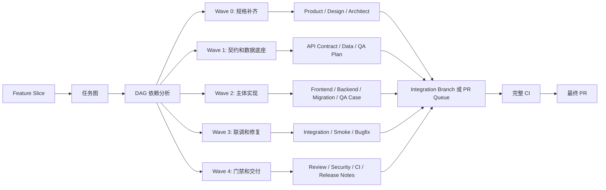
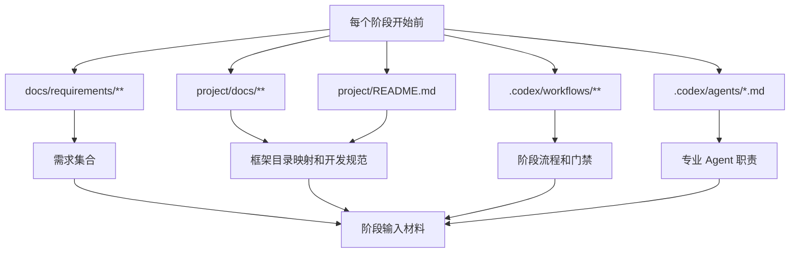

# 项目工作流程图

本流程图描述本仓库基于 `project/` 现有 Snowy 框架进行增量开发的标准协作流程。业务需求来自 `docs/requirements/**`，框架结构和开发规范来自 `project/docs/**`。

本项目已将 `Agents365-ai/365-skills` 安装到 `.codex/skills/`。本文件以及工作流中涉及流程图、架构图、模块图、ERD、状态机图、时序图、任务图、DAG、依赖图或系统可视化时，默认使用 `.codex/skills/mermaid-skill`；需要可编辑 Draw.io、复杂样式、泳道或厂商图标时使用 `.codex/skills/drawio-skill`；需要 PlantUML/UML/C4 语义时使用 `.codex/skills/plantuml-skill`；需要手绘白板风格时使用 `.codex/skills/excalidraw-skill`。图形产物必须按对应 skill 的校验流程生成和导出。

根目录 `PROJECT_ARTIFACTS.html` 统一导航需求、PRD、原型、设计、技术方案、图表、测试、审查、发布和验收等非代码产物。每次新增、重命名或删除产物后执行 `python scripts/update_artifact_index.py`，阶段放行前确认导航条目存在且链接可打开。

## 主流程

```mermaid
%%{init: {"theme": "base", "themeVariables": {"background": "#ffffff", "mainBkg": "#f8f7ff", "secondBkg": "#ffffff", "primaryColor": "#f8f7ff", "primaryBorderColor": "#7c6fbd", "primaryTextColor": "#222222", "lineColor": "#555555", "edgeLabelBackground": "#ffffff", "fontFamily": "Microsoft YaHei, SimHei, Arial, sans-serif"}}}%%
flowchart TD
    A([需求或开发请求]) --> B["Orchestrator 进入项目工作流"]
    B --> C["读取 AGENTS.md、workflow、skill"]
    C --> D["前置 1: 开发环境检测"]
    D --> D1["只读自检: Git、Node、npm、依赖、JDK17、Maven、IDEA、MySQL CLI、MySQL、Redis"]
    D1 --> D2["输出检测清单: 通过 / 警告 / 失败"]
    D2 --> D3["写入本机状态: docs/workflow/local-environment-status.md<br/>该文件被 .gitignore 忽略"]
    D3 --> E{"环境选择"}
    E -- "1 通过" --> E1["前置 2: 分支确认<br/>输出当前 Git 分支和工作区状态"]
    E -- "2 警告继续" --> E1
    E -- "3 阻塞处理" --> D4["处理环境问题后重新自检"]
    E -- "4 暂停" --> END0([暂停])
    D4 --> D
    E1 --> E2{"分支选择"}
    E2 -- "1 当前分支" --> F["前置 3: 创建需求集成分支"]
    E2 -- "2 切换分支" --> E1
    E2 -- "3 暂停" --> END0

    F --> G["阶段 1: 需求和框架装载<br/>读取 docs/requirements/**"]
    G --> H["读取 project/docs/**、project/docs/patterns/**、project/README.md"]
    H --> I{"需求、框架和环境信息是否充分"}
    I -- 否 --> I1["补充或澄清需求 / 框架文档"]
    I1 --> G

    I -- 是 --> J{"选择开发模式"}
    J -- "快速" --> J1["简单 CRUD 快速模式<br/>优先使用模式缓存<br/>可跳过 PRD/UI<br/>保留最小需求、字段、接口、表结构、验收和风险"]
    J -- "标准" --> K{"是否需要 PRD / 低保真原型"}
    J -- "严格" --> J2["高风险严格模式<br/>加强技术、数据、安全、QA、Review 门禁"]
    J -- "自定义" --> J3["记录自定义流程和不可跳过风险"]
    J1 --> N
    J2 --> K
    J3 --> K

    K -- "生成" --> L["Product Agent<br/>PRD、验收标准、HTML PRD、低保真 HTML 原型"]
    L --> L0{"是否涉及后管 / 后台 / 管理端 / 运营端"}
    L0 -- 是 --> L2["使用 snowy-admin-prototype-designer skill<br/>套用 admin-prototype-design-workflow<br/>先输出严格需求到原型页面蓝图"]
    L2 --> L2A["蓝图必须包含原始需求摘录、原子需求清单、字段来源、操作来源和逐项覆盖矩阵<br/>运行 validate_admin_blueprint.py"]
    L2A --> L2B{"蓝图校验通过"}
    L2B -- 否 --> L2
    L2B -- 是 --> L2C["Product Agent 在当前任务直接生成原型<br/>不使用 executing-plans 或逐 Task 派发<br/>超过 10 页按模块连续生成，共享入口由单一 Owner 汇总"]
    L2C --> L3["复制完整运行时组件目录<br/>按蓝图引入查询、表格、抽屉、弹窗和标注组件<br/>缺少时参考 Snowy、Demo 或 Ant Design Vue"]
    L3 --> L4["生成多文件 Snowy 后管拟真原型<br/>保留原始 Demo 内容密度、样式和标注能力<br/>入口只引用组件，禁止重新内嵌完整实现"]
    L4 --> L4A{"canonical 哈希、组件可达性、逐页契约、运行时截图和覆盖矩阵是否通过"}
    L4A -- 否 --> L2
    L4A -- 是 --> LH{"是否涉及 H5 / 移动端"}
    L0 -- 否 --> LH
    LH -- 是 --> LH1["使用 snowy-h5-app-designer skill<br/>读取 project/h5/src/views 实际业务页面模式<br/>先输出 H5 逐页蓝图"]
    LH1 --> LH2["运行 validate_h5_blueprint.py<br/>从 H5 多文件原型骨架生成页面<br/>保留自动标注和用户标注运行时"]
    LH2 --> LH3{"静态校验、移动端逐页交互、标注作用域和持久化是否通过"}
    LH3 -- 否 --> LH1
    LH3 -- 是 --> L1
    LH -- 否 --> L1{"PRD / 原型确认"}
    K -- "跳过" --> K1["记录跳过原因和最小需求说明"]
    L1 -- 否 --> L
    L1 -- 是 --> M{"是否需要 UI / Figma"}
    K1 --> M

    M -- "生成" --> M1["Design Agent<br/>设计系统、Figma、Ready for Dev、Handoff"]
    M -- "跳过" --> M2["复用 Snowy 现有 UI 模式并记录约束"]
    M1 --> M3{"UI 设计确认"}
    M3 -- 否 --> M1
    M3 -- 是 --> N
    M2 --> N

    N["Architect / Data: 模块边界、API、状态机、表结构、migration、回滚、安全"] --> O{"技术和数据方案确认"}
    O -- 否 --> N
    O -- 是 --> P["Orchestrator 拆 Feature Slice"]
    P --> Q["生成任务图、DAG、Wave、Owner、Branch/Worktree 策略"]
    Q --> R{"开发计划确认"}
    R -- 否 --> P
    R -- 是 --> S["从需求集成分支创建 worktree 开发分支 / 目录"]
    S --> T["Frontend / Backend / Data / QA / Security 开发"]
    T --> U["本地门禁: lint、typecheck、test、build、migration、smoke"]
    U --> V{"门禁通过或风险已记录"}
    V -- 否 --> T

    V -- 是 --> W["Worktree 提交并合并回需求集成分支"]
    W --> X{"需求集成分支验证无误"}
    X -- 否 --> T
    X -- 是 --> Y{"是否合并回开发分支"}
    Y -- 否 --> Z["保留在需求集成分支，等待人工决定"]
    Y -- 是 --> Y1["合并回开发分支"]
    Z --> AA["Reviewer / Security / QA / Performance / Maintainability 审查"]
    Y1 --> AA
    AA --> AB{"P0 / P1 全部修复"}
    AB -- 否 --> T
    AB -- 是 --> AC["CI: lint、test、build、安全扫描等"]
    AC --> AD{"CI 和人工审批通过"}
    AD -- 否 --> T
    AD -- 是 --> AE["预发验证、灰度发布、全量发布"]
    AE --> AF["发布后监控、验收、复盘"]
    AF --> NAV["刷新 PROJECT_ARTIFACTS.html<br/>校验全部非代码产物链接"]
    NAV --> AG([完成])
```

## 并行开发子流程

## 必读输入

## 当前框架目录映射

| 类型 | 路径 |
| --- | --- |
| 前端 | `project/snowy-admin-web/` |
| H5 前端 | `project/h5/` |
| 后端启动模块 | `project/snowy-web-app/` |
| 后端插件实现 | `project/snowy-plugin/` |
| 后端插件 API | `project/snowy-plugin-api/` |
| 后端公共模块 | `project/snowy-common/` |
| 框架文档 | `project/docs/` |

## 关键门禁

- 未读取 `docs/requirements/**` 和 `project/docs/**`，不进入产品设计、技术设计或开发。
- 未完成开发环境只读自检并输出 `✅`、`⚠️`、`❌` 清单，不进入分支确认。
- 环境检测和分支确认必须分成两步；未输出当前 Git 分支并取得开发者确认作为开发分支，不创建需求集成分支、worktree、需求状态文件或进入代码开发。
- 开发必须遵循 `当前分支 -> 需求集成分支 -> worktree 开发分支/目录 -> 合回需求集成分支 -> 询问是否合回当前分支`。
- 首次执行流程前，未使用 `.codex/skills/snowy-framework-bootstrap` 执行只读自检、输出框架运行提示并取得开发者确认，不进入产品设计、技术设计或开发。
- 开发环境检测必须用列表展示 Git、Node.js、npm、前端依赖、JDK 17、Maven、IDEA、MySQL CLI、MySQL 服务、Redis 服务，并用 `✅`、`⚠️`、`❌` 标明结果；`检测：` 后必须换行，每个检测项独占一行。
- 开发环境检测结果写入 `docs/workflow/local-environment-status.md`，该文件被 `.gitignore` 忽略，不提交到 Git；`docs/workflow/status.md` 保持可提交。
- PRD 和低保真 HTML 原型未确认，不进入 UI 设计。
- 涉及后管且未跳过原型时，必须使用 `.codex/skills/snowy-admin-prototype-designer` 并套用 `.codex/workflows/admin-prototype-design-workflow.md`，先输出严格页面蓝图。蓝图通过后必须读取原始 Demo 金标和 `components/` 组件清单，复用原始 Snowy 壳、查询、表格、上传、抽屉、弹窗、组件预设和完整标注能力。禁止精简 Schema 渲染器、平行标注、万能字段集或覆盖基础 CSS。必须通过组件哈希、静态、运行时、截图和覆盖矩阵验收。
- 涉及 H5/移动端且未跳过原型时，必须使用 `.codex/skills/snowy-h5-app-designer`，优先读取 `project/h5/src/views/` 中最接近的实际业务页面，再以 `/demo` 和 Vant 补充组件。必须先输出 H5 逐页蓝图并通过 `validate_h5_blueprint.py`，再从 H5 多文件骨架生成页面；保留自动需求标注、任意节点用户标注、全局/页面作用域隔离、本地持久化、页面需求和另存为能力，并通过 `validate_h5_prototype.py` 与 320/375/390/414px 浏览器逐页验证。
- Product 阶段由当前 Product Agent 直接生成 PRD、蓝图和原型，不使用代码开发型 `executing-plans`、`subagent-driven-development`、worktree 或逐 Task Owner 流程。只有开发者明确要求执行既有计划，或任务已进入经确认的业务代码开发阶段时才允许使用 `executing-plans`。超过 10 个页面时按模块连续生成独立蓝图/业务配置，由一个 Owner 汇总共享 HTML；需求来源未变化时复用已确认产物。默认只做一次生成前需求/蓝图审查和一次最终原型审查，只有明确 `FAIL`、P0 或 P1 才增加修复复审。
- 后管原型必须从完整原始 Demo 的运行时组件目录生成，`index.html` 通过本地脚本实际引入组件。业务页面按字段语义复用预设表单、表格、上传、状态、开关、附件、头像、进度、长文本和动作组件；缺少组件时可参考 Snowy 真实框架、最接近的 Demo 组件或 Ant Design Vue 官方组件进行选择和组合，仍不满足时再新增并登记。每页字段独立完整，禁止原生文件输入、字段名猜测和万能业务字段集。
- 后管原型必须包含从蓝图生成的逐页 `prototype-contract.json`。静态门禁将受保护组件与 canonical Demo manifest 对比，并检查核心组件从 `app/main.js` 真实可达、无字段截断和万能页面引擎；运行时门禁逐页验证查询控件、表头、工具栏、分页、Demo 布局指标和默认标注目标/气泡，并输出截图供最终视觉审查。
- Figma UI 未确认，不进入技术设计。
- 技术设计、数据模型、migration 和回滚策略未确认，不进入开发。
- 开发环境检测必须检测可用 MySQL CLI；PATH 找不到 `mysql` 时自动搜索常见安装目录中的 `mysql.exe` 并用绝对路径验证。PATH 和搜索都找不到时记录全局状态 `blocked_missing_mysql_cli`，不进入 PRD/UI/技术设计或开发阶段。
- 开发必须基于 `project/` 现有 Snowy 框架增量实现，不按空白项目重建目录。
- 工作流中的流程图、架构图、ERD、状态机图、任务图、DAG 和依赖图必须使用 `.codex/skills/` 下的 365 diagram skills 生成与校验，默认 Mermaid，复杂可编辑图使用 Draw.io。
- 任何阶段新增、重命名或删除非代码产物后必须执行 `python scripts/update_artifact_index.py`；根目录 `PROJECT_ARTIFACTS.html` 未登记对应产物或存在失效链接时，不得宣称该阶段完成。
- 涉及金额、权限、状态机、资源数量、业务单据、交易、逆向流程、删除和批量操作的改动必须重点审查。
- 开发 Agent 不能自己给自己放行，必须经过 Review、CI 和人工审批。
- P0 必须修复；P1 合并前应修复；CI 和发布检查未通过不进入全量发布。
