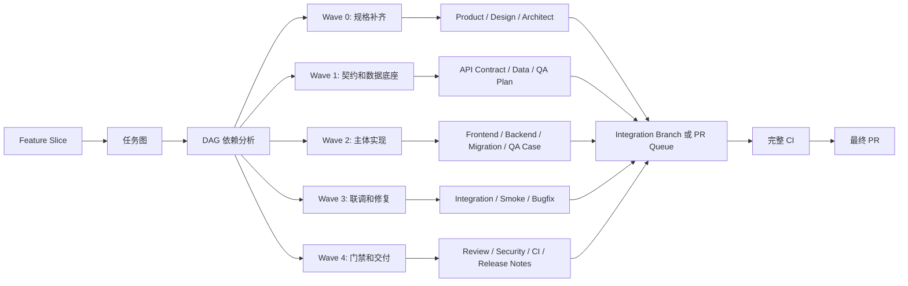
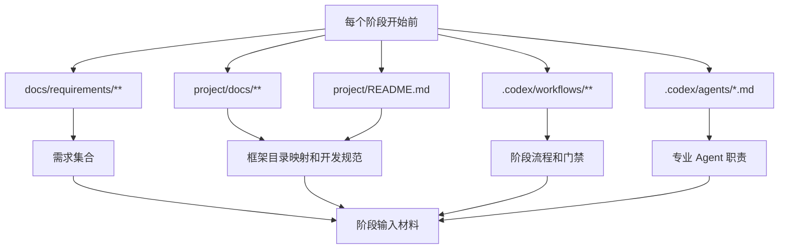

# 项目工作流程图

本流程图描述本仓库基于 `project/` 现有 Snowy 框架进行增量开发的标准协作流程。业务需求来自 `docs/requirements/**`，框架结构和开发规范来自 `project/docs/**`。

## 主流程

```mermaid
flowchart TD
    A([需求或开发请求]) --> B[Orchestrator 声明阶段]
    B --> B1[输出当前 Git 分支和工作区状态]
    B1 --> B2{开发者确认当前分支为最终合并目标}
    B2 -- 否 --> B3[切换分支或暂停]
    B3 --> B1
    B2 -- 是 --> B4[从当前分支创建需求集成分支]
    B4 --> C[读取 AGENTS.md]
    C --> D[读取 .codex/workflows/**]
    D --> E[读取 .codex/agents/*.md]
    E --> F[读取 docs/requirements/**]
    F --> G[读取 project/docs/** 和 project/README.md]
    G --> G1[使用 snowy-framework-bootstrap 输出运行提示并等待开发者确认]
    G1 --> H{需求、框架和环境信息是否充分}

    H -- 否 --> H1[补充或澄清需求/框架文档]
    H1 --> F

    H -- 是 --> I[Product Agent: PRD、验收标准、HTML PRD、低保真 HTML 原型]
    I --> J{PRD 和低保真原型确认}
    J -- 否 --> I

    J -- 是 --> K[Design Agent: 设计系统、Figma 可落地设计稿、Ready for Dev、Handoff]
    K --> L{UI 设计确认}
    L -- 否 --> K

    L -- 是 --> M[Architect Agent: 模块边界、API、状态机、安全、运维]
    M --> N[Data Agent: 数据模型、Migration、索引、回滚、一致性]
    N --> O{技术设计和数据设计确认}
    O -- 否 --> M

    O -- 是 --> P[Orchestrator: 按用户价值拆 Feature Slice]
    P --> Q[套用 auto-dispatch-parallel-development.md]
    Q --> R[生成任务图、依赖 DAG、并行 Wave、Owner、Branch/Worktree 策略]
    R --> R1[从需求集成分支创建 worktree 开发分支/目录]
    R1 --> S{用户或负责人确认开发计划}
    S -- 否 --> P

    S -- 是 --> T[Frontend/Backend/Data/QA/Security 等 Agent 并行或串行开发]
    T --> U[本地质量门禁: lint、typecheck、test、build、migration、smoke]
    U --> V{本地门禁通过或风险已记录}
    V -- 否 --> T

    V -- 是 --> W[Worktree 提交并合并回需求集成分支]
    W --> W1{需求集成分支验证无误}
    W1 -- 否 --> T
    W1 -- 是 --> W2{是否合并回最初当前分支}
    W2 -- 否 --> X[Reviewer/Security/QA/Performance/Maintainability 审查]
    W2 -- 是 --> W3[合并回最初当前分支]
    W3 --> X[Reviewer/Security/QA/Performance/Maintainability 审查]
    X --> Y{P0/P1 是否全部修复}
    Y -- 否 --> T

    Y -- 是 --> Z[CI: lint、test、build、安全扫描等]
    Z --> AA{CI 和人工审批通过}
    AA -- 否 --> T

    AA -- 是 --> AB[预发验证、灰度发布、全量发布]
    AB --> AC[发布后监控、验收、复盘]
    AC --> AD([完成])
```

## 并行开发子流程

## 必读输入

## 当前框架目录映射

| 类型 | 路径 |
| --- | --- |
| 前端 | `project/snowy-admin-web/` |
| 后端启动模块 | `project/snowy-web-app/` |
| 后端插件实现 | `project/snowy-plugin/` |
| 后端插件 API | `project/snowy-plugin-api/` |
| 后端公共模块 | `project/snowy-common/` |
| 框架文档 | `project/docs/` |

## 关键门禁

- 未读取 `docs/requirements/**` 和 `project/docs/**`，不进入产品设计、技术设计或开发。
- 未输出当前 Git 分支并取得开发者确认，不创建需求集成分支、worktree 或进入代码开发。
- 开发必须遵循 `当前分支 -> 需求集成分支 -> worktree 开发分支/目录 -> 合回需求集成分支 -> 询问是否合回当前分支`。
- 首次执行流程前，未使用 `.codex/skills/snowy-framework-bootstrap` 输出框架运行提示并取得开发者确认，不进入产品设计、技术设计或开发。
- PRD 和低保真 HTML 原型未确认，不进入 UI 设计。
- Figma UI 未确认，不进入技术设计。
- 技术设计、数据模型、migration 和回滚策略未确认，不进入开发。
- 开发环境检测必须检测 `mysql` 指令；未找到时记录全局状态 `blocked_missing_mysql_cli`，不进入 PRD/UI/技术设计或开发阶段。
- 开发必须基于 `project/` 现有 Snowy 框架增量实现，不按空白项目重建目录。
- 涉及金额、权限、状态机、资源数量、业务单据、交易、逆向流程、删除和批量操作的改动必须重点审查。
- 开发 Agent 不能自己给自己放行，必须经过 Review、CI 和人工审批。
- P0 必须修复；P1 合并前应修复；CI 和发布检查未通过不进入全量发布。
